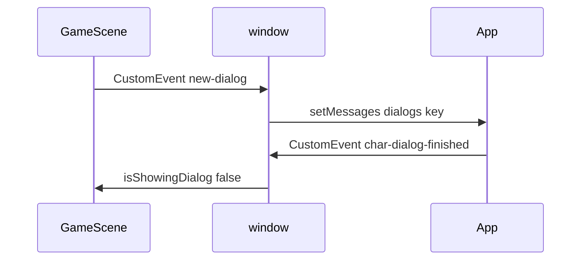

# Contest mini-game: riddles, E to interact, win condition

## Current behavior (baseline)

- **Interact:** Overlap between `[heroActionCollider](src/game/scenes/GameScene.js)` and Tiled `actions` objects with property `**dialog`** (string = React dialog key). Trigger uses **Enter** (`JustDown(this.enterKey)`), not E.
- **UI:** `[App.js](src/App.js)` listens for `new-dialog`, looks up static `dialogs[characterName]`, renders `[DialogBox](src/game/DialogBox.js)` (multi-page text only, no input).
- **Blocking:** `isShowingDialog` in `GameScene` freezes movement/attack in `update()` until React fires `{characterName}-dialog-finished`.
- **Persistence across maps:** `[scene.restart](src/game/scenes/GameScene.js)` passes a fresh `heroStatus` object (health, coin, flags, position). **Anything not included there is lost** on teleport—so solved riddles must be added to this payload (or equivalent `initData` field).




---

## Target behavior

1. Player **roams** (existing grid movement unchanged).
2. **Multiple interactables** on the map(s), authored in Tiled like today (object layer `actions`).
3. **Press E** to interact when overlapping a hotspot (keep **Enter** as optional alias for accessibility unless you explicitly want E-only).
4. **Popup** shows: riddle **text**; if the riddle has answers, show a **text field** + submit (and clear wrong-answer feedback).
5. **Win:** When every **required** riddle has been answered correctly once, show a **victory** state (recommend React overlay first—fastest; optional Phaser `VictoryScene` later).

---

## 1. Data model: riddles manifest (single source of truth)

Add a JSON module (or TS if you migrate later), e.g. `[src/game/data/contestRiddles.json](src/game/data/contestRiddles.json)` (imported in React; optionally duplicated read in Phaser only if you validate server-side later—here client-only is fine).

**Suggested shape per riddle:**

- `id` (string): stable key referenced from Tiled.
- `title` (optional): shown in popup header.
- `prompt` (string): main riddle body (plain text; multiline OK).
- `acceptableAnswers` (string[], optional): if **empty or omitted**, treat as **info-only** (no input; dismiss with button like current dialog).
- `normalize` rules (in code, not JSON): trim, lowercase, collapse whitespace; optional strip punctuation for forgiving grading.
- `countsTowardWin` (boolean, default `true` when `acceptableAnswers.length > 0`, else `false`): lets you add flavor text stations that do not block winning.

**Win set:** `requiredIds =` all riddle ids where `countsTowardWin === true` (or explicit `winRequires: string[]` at root of manifest—pick one approach and stick to it).

---

## 2. Tiled / map authoring

**Option A (recommended):** New object property name to avoid colliding with old NPC-style `dialog`:

- Property name: `**riddleId`** (string) = key into the manifest.

Keep existing `**dialog`** objects working if you still need old signs/NPCs; new contest stations use `**riddleId**` only.

**In `[GameScene.js](src/game/scenes/GameScene.js)`** `switch (name)` inside the `actions` loop, add:

```js
case 'riddleId': { /* same overlap + E/Enter as dialog, different event payload */ }
```

**Workflow for you:** In Tiled, place a 16×16 (or same size as current triggers) object on `actions`, add custom property `riddleId` = e.g. `resistor_riddle_01`. No need to paste riddle text into Tiled.

---

## 3. Phaser: E key + event contract

**Keys** in `GameScene.create()`:

- Add `this.interactKey = this.input.keyboard.addKey(Input.Keyboard.KeyCodes.E)` (and optionally keep Enter for the same checks: `interactPressed = JustDown(eKey) || JustDown(enterKey)`).

**Replace or parallel dialogs for riddles:**

- Where `dialog` and NPC talk use `new-dialog`, riddles dispatch a **new** event, e.g. `**open-riddle`** with `detail: { riddleId }`.
- React validates `riddleId` exists in manifest; if missing, log error and close.

**Close / result events** (cleaner than per-id listener explosion):

- `**riddle-ui-closed`** with `detail: { riddleId, outcome: 'correct' | 'dismissed' | 'wrong' }`
  - `**correct`:** Phaser adds `riddleId` to `solvedRiddleIds`, marks this hotspot **solved** (see below), runs **win check**.
  - `**dismissed`:** User closed info-only or gave up without solving (define whether dismiss on text-only counts as “seen”; usually N/A for win).
  - `**wrong`:** Optional; Phaser may only need to clear `isShowingDialog`—no state change.

Reuse the same `**isShowingDialog`** (or rename to `isModalOpen`) so movement stays blocked while the React popup is open. On `riddle-ui-closed`, same delayed `isShowingDialog = false` pattern as existing dialog listeners.

**Per-hotspot “already solved”:**

- Store `solvedRiddleIds` in `**heroStatus`** (e.g. `heroStatus.solvedRiddleIds: string[]`) initialized in `[MainMenuScene.js](src/game/scenes/MainMenuScene.js)` as `[]`.
- On each `riddleId` object, you need a **unique instance id** if the same riddle could appear twice (unlikely). Simpler approach: **one riddle id per station**; solved = global for that id. If you need duplicate copies of the same question, add Tiled property `**riddleInstanceId`** and track solved pairs `(riddleId, instanceId)`—only add if your contest needs it.

**Teleport / restart:** Extend every `heroStatus` construction in `[GameScene.js](src/game/scenes/GameScene.js)` `scene.restart` payload to include `solvedRiddleIds: [...this.solvedRiddleIds]` (read from a scene field you set from `init`).

---

## 4. React: riddle popup component

**New component** e.g. `[src/game/RiddlePopup.js](src/game/RiddlePopup.js)` (or `ContestRiddleModal.js`):

- Props: `riddle` (manifest entry), `gameSize`, `onClose(outcome, extra?)`.
- Layout: title, prompt (`Typography` or plain div with pixel font styles matching `[DialogBox](src/game/DialogBox.js)`).
- If `acceptableAnswers?.length`:
  - MUI `TextField` (variant outlined, fullWidth), **Submit** button.
  - On submit: compare normalized input to normalized `acceptableAnswers`; if match → `onClose('correct')`; else show inline “Try again” (no Phaser event until close/submit as you prefer).
- If no answers: single **OK** / **Close** → `onClose('dismissed')` (info kiosk).

**Keyboard:**

- **E** should **not** submit while typing if it re-triggers interact—use `stopPropagation` on keydown in the modal or ignore Phaser when document.activeElement is the input (Phaser still runs; the usual pattern is modal open = `isShowingDialog` so hero does not move; E in input is handled by browser). Optionally disable Phaser listening for E while modal open by checking a flag—simplest is rely on `isShowingDialog` and not binding E to Phaser actions while modal is open (interact only fires on overlap edge case: user holds E—use `JustDown` only).

**App wiring** in `[App.js](src/App.js)`:

- State: `activeRiddleId` (null | string) or `activeRiddle` object.
- Listener: `open-riddle` → set state, lookup manifest.
- On correct: dispatch `**riddle-ui-closed`** with outcome `correct` (Phaser updates).
- Optional: global progress indicator in React (e.g. “3 / 7”) driven by events `riddle-progress` dispatched from Phaser whenever solved set changes (or compute in React if you pass solved count up—Phaser is source of truth for “authoritative” progress unless you lift state).

---

## 5. Win condition

**In Phaser** after adding an id to `solvedRiddleIds`:

- `requiredIds` from manifest (import in Phaser **or** duplicate a small generated list—simplest: `import contestManifest from '../data/contestRiddles.json'` in `GameScene` if webpack JSON import is already supported—CRA does).
- If `requiredIds.every(id => solvedRiddleIds.includes(id))` → **win**.

**Win presentation (pick one):**

1. **React victory overlay** (recommended first): dispatch `contest-won`; App shows full-screen message + “Play again” / link; Phaser can `scene.pause()` or set a flag to ignore input.
2. **Phaser scene:** `scene.start('VictoryScene', { ... })` mirroring `[GameOverScene.js](src/game/scenes/GameOverScene.js)` menu pattern.

Also **preload** `[BootScene.js](src/game/scenes/BootScene.js)` if you add only JSON—no change. If you add victory assets, load there.

---

## 6. Optional simplifications for a contest build

Not required for riddles, but often desirable:

- **Disable combat / enemies / sword** for a puzzle-only walk: skip spawning from `enemyData`, or use a map without enemies; remove sword/push pickups from contest maps.
- **Remove game over** or keep it irrelevant if no damage sources.
- **Main menu** copy: retitle to contest name; “Start” begins at your contest map `mapKey`.

---

## 7. Files to touch (checklist)


| File                                                                                 | Changes                                                                                                  |
| ------------------------------------------------------------------------------------ | -------------------------------------------------------------------------------------------------------- |
| `[src/game/data/contestRiddles.json](src/game/data/contestRiddles.json)`             | New: all riddle definitions + win rules                                                                  |
| `[src/game/RiddlePopup.js](src/game/RiddlePopup.js)`                                 | New: UI + validation                                                                                     |
| `[src/App.js](src/App.js)`                                                           | State + `open-riddle` / `riddle-ui-closed` listeners; render `RiddlePopup`; optional victory UI          |
| `[src/game/scenes/GameScene.js](src/game/scenes/GameScene.js)`                       | `E` key; `riddleId` case; `solvedRiddleIds` on `heroStatus`; teleport `restart` carries it; win dispatch |
| `[src/game/scenes/MainMenuScene.js](src/game/scenes/MainMenuScene.js)`               | Initial `heroStatus.solvedRiddleIds = []`; set starting `mapKey` to contest map                          |
| Tiled JSON under `[src/game/assets/sprites/maps/...](src/game/assets/sprites/maps/)` | Add `riddleId` objects; import map in BootScene if new file                                              |
| `[docs/GAME_ARCHITECTURE.md](docs/GAME_ARCHITECTURE.md)`                             | Document new events + Tiled property                                                                     |


---

## 8. Testing checklist

- Overlap + **E** opens popup; movement frozen.
- Correct answer → popup closes, station cannot be “won” twice (either hide prompt or show “Completed”).
- Wrong answer → stays open, message shown.
- Info-only riddle → no input, dismiss works.
- Teleport to another map and back → **solved list persists**.
- Solve all required → win UI appears.
- **Enter** still works if you keep dual-bind.

---

## 9. Edge cases to decide (defaults suggested)


| Topic                           | Suggested default                        |
| ------------------------------- | ---------------------------------------- |
| Case sensitivity                | Case-insensitive                         |
| Multiple acceptable spellings   | List in `acceptableAnswers`              |
| Spaces / punctuation            | Normalize in code                        |
| Player closes without answering | `dismissed` — does not add to solved     |
| Same riddle id two places       | Avoid in maps, or add `instanceId` later |


If you want **time limits** or **hint after N wrong tries**, add fields to manifest and state in `RiddlePopup`—out of scope unless you ask for it.