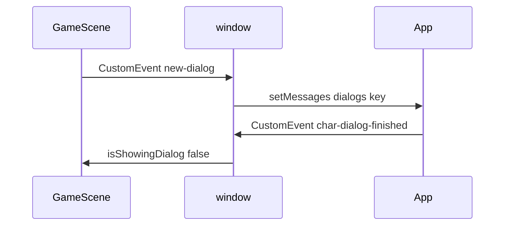

# Contest mini-game — implementation plan

**Source of truth for phases:** [docs/CONTEST_GAME_PHASED_SPEC.md](../../docs/CONTEST_GAME_PHASED_SPEC.md)

This file started as a **riddle-only prototype** plan (`riddleId`, local `contestRiddles.json`, win when all riddles solved). The product spec has **superseded** that for Phase 1+ (bootstrap, `stationId`, `/validate-answer`, 16-char `componentHash`, `localStorage`, final win via `/validate-circuit-final`). **§Phase 0 below is authoritative for map work.** **§Appendix** keeps the old notes for reference only.

---

## Phase 0 — Map authoring and contest layout baseline

**Must match** [CONTEST_GAME_PHASED_SPEC.md § Phase 0](../../docs/CONTEST_GAME_PHASED_SPEC.md).

### Goals

- **Multi-room, one level** — either linked Tiled maps + teleports (existing pattern) or one map with disjoint regions.
- **Station markers** — object layer `**actions`**, custom property `**stationId`** (string, unique per kiosk). Do **not** use `riddleId` in new maps.
- **Placement zone** — tiles (or layer) queryable in Phaser for “may place component here”, e.g. tile property `**contest_placeable: true`**, or an object layer you merge at runtime. Required before Phase 4 placement code; authoring happens in Phase 0.

### Deliverables

- Map JSON under `[src/game/assets/sprites/maps/](../../src/game/assets/sprites/maps/)`.
- Import + `load.tilemapTiledJSON` in `[BootScene.js](../../src/game/scenes/BootScene.js)`.
- `[MainMenuScene.js](../../src/game/scenes/MainMenuScene.js)` starts the contest entry `mapKey`.
- Optional: short `[docs/TILED_CONTEST.md](../../docs/TILED_CONTEST.md)` or a subsection in the phased spec listing `stationId` + `contest_placeable` conventions.

### Acceptance (Phase 0)

- Game loads your layout; player walks intended bounds; **no** riddle UI required yet.
- In code or a dev log, you can read `**contest_placeable`** (or chosen equivalent) for at least one tile in the build area.

### Not in Phase 0

- `POST /contest/bootstrap`, `/validate-answer`, `RiddlePopup`, inventory, placement input, circuit validation — those are **Phase 1+** per the phased spec.

---

## Current engine behavior (baseline)

- **Interact today:** `[GameScene.js](../../src/game/scenes/GameScene.js)` — overlap `heroActionCollider` + `actions` objects; property `**dialog`** + **Enter**.
- **UI:** `[App.js](../../src/App.js)` — `new-dialog` → static `dialogs` → `[DialogBox](../../src/game/DialogBox.js)`.
- **Blocking:** `isShowingDialog` freezes movement until React finishes dialog.

---

## Appendix A — Legacy prototype (pre–phased spec)

The following described a **minimal** vertical slice **without** access code, **without** mock backend prompts, and **win = all riddles in JSON solved**. Use only if you intentionally defer the spec; otherwise implement **Phase 1** from [CONTEST_GAME_PHASED_SPEC.md](../../docs/CONTEST_GAME_PHASED_SPEC.md).

### A.1 Old data model (superseded)

- ~~`contestRiddles.json`~~ with `acceptableAnswers` on client → **replaced by** server/mock `**POST /validate-answer`** (no answer in response).

### A.2 Old Tiled property (superseded)

- ~~`riddleId`~~ → use `**stationId`**; prompts from `**/contest/bootstrap`**.

### A.3 Old win condition (superseded)

- ~~Win when `solvedRiddleIds` covers manifest~~ → **win only via `POST /validate-circuit-final`** per spec; optional frontend **Q** check is non-authoritative.

### A.4 Old file checklist (superseded)

| File                  | Old plan                        | Current spec                                        |
| --------------------- | ------------------------------- | --------------------------------------------------- |
| `contestRiddles.json` | Required                        | Not source of truth; mock backend module instead    |
| `GameScene`           | `riddleId` case                 | `stationId` + active set from config                |
| Win                   | `contest-won` after all riddles | `victory` after `/validate-circuit-final` (Phase 7) |

---

## Appendix B — Optional contest build cleanup

- Disable NPCs, enemies, combat, bush/box, or use `ContestGameScene` / `GAME_MODE === 'contest'`.
- Hide HeroHealth / HeroCoin in contest mode.

---

## Appendix C — Testing ideas (post Phase 1)

- Phase 0: load map, walk rooms, assert placement tiles flagged correctly (manual or dev overlay).
- Phase 1: access code → bootstrap; E on active `stationId` only; validate-answer returns hash, never plaintext answer; reload restores from **localStorage** per spec.

If you want **time limits** or **hints after N wrong tries**, add fields to backend contract and `RiddlePopup`—not in baseline spec.