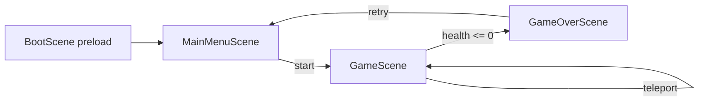

# Game architecture reference

**Purpose:** Living document for how this repo is put together, where to change behavior, and how React and Phaser interact. Update this file when you add scenes, events, or map conventions.

**Last analyzed:** 2026-04-06 (initial pass over `src/` and `src/game/assets`).

---

## High-level overview

This is a **Create React App–style** web app (custom webpack in `config/`) that mounts a single **Phaser 3** game inside a DOM node and overlays **React UI** (Material-UI v4, pixel font) for dialogs, menus, health, and coins. World simulation, maps, and combat live in Phaser; narrative chrome and HUD live in React.

**Core idea:** Phaser and React do **not** share React state. They communicate through **`window` `CustomEvent`s** with agreed event names and `detail` payloads.

---

## Tech stack (relevant to the game)

| Layer | Technology |
|--------|------------|
| UI shell | React 17, `@material-ui/core` / `styles`, `classnames`, `react-spring` (typewriter dialog) |
| Game | Phaser 3, **grid-engine** (grid movement, pathing, NPC/enemy motion) |
| Physics | Phaser Arcade (mostly colliders/overlaps; gravity off on custom bodies) |
| Maps | Tiled JSON → `this.load.tilemapTiledJSON` + `make.tilemap` |
| Art | Texture atlases (`*.png` + `*.json`), single shared `tileset` image |

---

## Repository layout (game-related)

```
src/
  index.js              # ReactDOM.render → <App />
  App.js                # Phaser.Game config, event listeners, overlay components
  App.css               # @font-face Press Start 2P
  game/
    constants.js        # Timing, tile GIDs, NPC/enemy modes, save key (save unused in code)
    utils.js            # calculateGameSize(), createInteractiveGameObject()
    scenes/
      BootScene.js      # Preload all assets → MainMenuScene
      MainMenuScene.js  # Logo + background; React menu; start GameScene with init data
      GameScene.js      # Main gameplay (maps, hero, NPCs, enemies, items, teleports)
      GameOverScene.js  # Retry / exit via React menu (see Known issues)
    DialogBox.js        # React: multi-page dialog, dispatches dialog-finished
    GameMenu.js         # React: keyboard + mouse menu
    HeroHealth.js       # React: heart row from healthStates[]
    HeroCoin.js         # React: coin counter
    Message.js          # React-spring letter reveal
    assets/             # Maps (JSON), atlases, images (png referenced by BootScene)
```

Build/tooling: `scripts/start.js`, `scripts/build.js`, `config/webpack.config.js` (standard CRA fork pattern).

---

## Phaser game bootstrap (`App.js`)

- **`calculateGameSize()`** (`game/utils.js`): Base logical size **400×224**, integer **multiplier** from `window` so the canvas scales in 16px steps; wrapper size is `width * multiplier` × `height * multiplier`.
- **Parent element:** `#game-content` — Phaser draws the canvas here.
- **`Phaser.Game` config highlights:**
  - `pixelArt: true`, `Scale.ENVELOP`, `CENTER_BOTH`
  - Scenes: `BootScene` → `MainMenuScene` → `GameScene` ↔ `GameOverScene`
  - **grid-engine** registered as a scene plugin with key `gridEngine` and mapping `gridEngine`
- **Game instance** is created once in `useEffect` with `[]` (no cleanup destroys the game on unmount — worth noting if you ever StrictMode-double-mount).

---

## React ↔ Phaser bridge (custom events)

All cross-boundary traffic uses **`window.dispatchEvent` / `addEventListener`**.

### Phaser → React

| Event | When | `detail` |
|--------|------|----------|
| `new-dialog` | Sign/object dialog or NPC/item pickup dialog | `{ characterName }` — must match a key in `App.js` `dialogs` and the finish event name below |
| `menu-items` | Main menu or game over menu shown | `{ menuItems: string[], menuPosition: 'center' \| 'left' }` |
| `hero-health` | Health changes / death | `{ healthStates: ('full'\|'half'\|'empty')[] }` — empty array hides HUD |
| `hero-coin` | Coin changes / death | `{ heroCoins: number \| null }` — `null` hides HUD |
| `open-station-riddle` | Contest: hero overlaps an **active** `stationId` and presses **E** or **Enter** | `{ stationId, title, prompt, accessCode, rewardComponentType }` — see [CONTEST_GAME_PHASED_SPEC.md](./CONTEST_GAME_PHASED_SPEC.md) |
| `contest-station-inactive` | Contest: hero overlaps a `stationId` and presses **E** or **Enter**, but there is **no session**, the station is **not** in `activeStationIds`, or bootstrap has **no** metadata for that id | `{ stationId, reason: 'no_session' \| 'inactive' \| 'no_metadata' }` — React shows a short non-blocking note |
| `contest-state-changed` | Contest: `localStorage` contest state was updated (bootstrap merge, new session, or successful riddle solve) | `{}` — inventory UI listens to refresh the read-only strip |

### React → Phaser

| Event | When | `detail` |
|--------|------|----------|
| `{characterName}-dialog-finished` | User finishes `DialogBox` | `{}` — `characterName` from React state (from last `new-dialog`) |
| `menu-item-selected` | User picks a menu row | `{ selectedItem }` — string must match what scenes expect (`start`, `exit`, `game.game_over.retry`, etc.) |
| `station-riddle-closed` | Contest riddle modal dismissed (submit success or cancel) | `{}` — `GameScene` clears `isShowingDialog` |

**Dialog content** is currently a static object in `App.js` (`dialogs`), keyed by the same string as Tiled `dialog` / NPC texture keys (`npc_01`, `sword`, `push`, …). To add lines or characters, extend that object (or refactor to JSON/i18n).

### Contest mini-game (overview)

Full behavior, APIs, and persistence are described in **[CONTEST_GAME_PHASED_SPEC.md](./CONTEST_GAME_PHASED_SPEC.md)**. Short pointers:

- **Bootstrap:** React calls the mock **`postContestBootstrap`** in [`src/game/api/mockContestBackend.js`](../src/game/api/mockContestBackend.js) after the user enters an access code; session config is stored on **`window.__CONTEST_SESSION__`** (`accessCode` + `config`) and **`MainMenuScene`** passes it into **`GameScene`** as **`contestSession`**.
- **Map:** Riddle kiosks use Tiled **`stationId`** on the **`actions`** object layer (not `riddleId`). Only ids listed in **`config.activeStationIds`** are interactable.
- **State:** [`src/game/contest/contestState.js`](../src/game/contest/contestState.js) persists **`contest_game_state_v1`** in **`localStorage`** (inventory slots, solved stations, etc.).
- **Riddles:** [`RiddlePopup.js`](../src/game/RiddlePopup.js) submits answers via **`postValidateAnswer`**; responses never include the correct answer string—only **`valid`** and optional **16-character `componentHash`**.
- **Placement zone:** Tile rectangles per `mapKey` in [`contestPlaceableBounds.js`](../src/game/contest/contestPlaceableBounds.js); **`GameScene#isWorldXYContestPlaceable`** (see [TILED_CONTEST.md](./TILED_CONTEST.md)). Extra tile layers for decoration were avoided so **grid-engine** does not walk broken layer data.

---

## Scene flow



1. **BootScene** — Loading bar UI in Phaser; loads tilemaps, atlases, images; `create()` → `MainMenuScene`.
2. **MainMenuScene** — Full-screen background + logo; fires `menu-items` with `['start','exit']`; listens once for `menu-item-selected`. **Start** passes `init` to `GameScene`: `heroStatus` (position, frame, facing, health 60/60, coin 0, flags), `mapKey: 'home_page_city_house_01'`, and optional **`contestSession`** from **`window.__CONTEST_SESSION__`** (set after contest bootstrap in `App.js`).
3. **GameScene** — See next section.
4. **GameOverScene** — Background + “game over” text; menu `game.game_over.retry` / `game.game_over.exit`; retry returns to main menu.

---

## `GameScene` — responsibilities (the main file to edit)

**Initialization:** `init(data)` stores `heroStatus`, `mapKey`, and optional **`contestSession`**. On `create()`:

1. **Input:** Arrow keys + WASD, **Enter** and **E** (interact / contest stations), Space (attack if sword).
2. **Map:** `make.tilemap({ key: mapKey })`, `addTilesetImage('tileset','tileset')`, each **tile** layer `createLayer` + `collider` with hero. Layers whose **layer property** `type === 'elements'` are tracked for bush/box interactions. Contest **placement** bounds are **not** an extra tile layer (see `contestPlaceableBounds.js`).
3. **Hero:** Arcade sprite `hero`, stats on sprite (`health`, `maxHealth`, `coin`, `canPush`, `haveSword`), methods `restoreHealth`, `increaseMaxHealth`, `collectCoin`, `takeDamage`. Three helper bodies:
   - **`heroActionCollider`** — interact/attack hitbox (moves with facing in `update`).
   - **`heroPresenceCollider`** — large overlap (320×320) for “can enemy see / follow hero”.
   - **`heroObjectCollider`** — smaller overlap for enemy “touch” damage.
4. **Object layer `actions`:** Iterates **every object’s properties** and switches on property **name**:
   - **`dialog`** — Rectangle trigger; **Enter** or **E** + overlap with action collider → `new-dialog` with `characterName` = property value.
   - **`stationId`** — Contest riddle kiosk; **Enter** or **E** when `contestSession.config.activeStationIds` includes this id → `open-station-riddle` with prompt metadata from bootstrap (not from Tiled).
   - **`npcData`** — String parsed by `extractNpcDataFromTiled`: `npcKey:movementType;delay;area;direction`. Adds NPC to grid-engine; `random` → `moveRandomly`.
   - **`itemData`** — `type:...` prefix (`coin`, `heart`, `heart_container`, `sword`, `push`) spawns pickup sprites (some gated by `heroHaveSword` / `heroCanPush`).
   - **`enemyData`** — `enemyType:enemyAI:speed:health` (see Enemies).
   - **`teleportTo`** — `mapKey:x,y` → fade out, `scene.restart` with preserved hero stats and new position.
5. **grid-engine:** `create(map, gridEngineConfig)` with hero + each enemy + each NPC. Subscribes to `movementStarted`, `movementStopped`, `directionChanged` to swap walk/idle frames.
6. **Combat:** Space triggers attack animation if `haveSword`; overlap action collider + enemy applies delayed damage if `isAttacking`. Enemies overlap object collider → attack anim + `takeDamage(10)` with cooldown from `getEnemyAttackSpeed`. Enemy death → random loot via `spawnItem`.
7. **World interactions:** Overlap action collider + **elements** tiles: **BUSH_INDEX** (428) destroyed on attack with loot chance; **BOX_INDEX** (427) push tween if `canPush` + attack and target cell has no `ge_collide` on any layer.

**Constants** from `constants.js`: `SCENE_FADE_TIME`, `ATTACK_DELAY_TIME`, `BUSH_INDEX`, `BOX_INDEX`, `NPC_MOVEMENT_*`, `ENEMY_AI_TYPE` (`follow` used in presence logic).

---

## Tiled / map authoring conventions

- **Tile size:** 16×16 (positions divide by 16 when placing grid characters).
- **Tileset in maps:** First gid set uses embedded tileset pointing at shared `tileset.png` (loaded as key `tileset`).
- **Layer property `type: elements`:** Required for layers that hold bushes/boxes the hero can strike (overlap uses tile **index** 428/427).
- **Object layer name:** `actions` (hardcoded in `GameScene`: `map.getObjectLayer('actions')`). Contest kiosks use property **`stationId`** (string); see [TILED_CONTEST.md](./TILED_CONTEST.md).
- **Contest placement mask:** Code in **`contestPlaceableBounds.js`** + **`isWorldXYContestPlaceable`** on `GameScene` (not a separate Tiled tile layer; avoids grid-engine / Phaser layer issues).
- **Grid-engine collision:** Comes from tile properties (e.g. `ge_collide`) as expected by grid-engine on the map JSON.
- **Teleport value format:** `teleportTo` = `"<mapKey>:<tileX>,<tileY>"` (see `extractTeleportDataFromTiled`).
- **NPC value format:** `npcData` = `"<atlasKey>:<movement>;<delay>;<area>;<facingDirection>"` (see `extractNpcDataFromTiled`).

Map JSON files live under `src/game/assets/sprites/maps/` (`cities/`, `houses/`). New maps must be **imported in `BootScene.js`** and loaded with a **string key** matching the Tiled JSON file key and `teleportTo` / `scene.start` references.

---

## Assets (preload)

**BootScene** loads:

- Tilemaps: `home_page_city`, `home_page_city_house_01`–`03`
- Atlases: `hero`, `slime`, `heart`, `coin`, `npc_01`–`npc_04`
- Images: `tileset`, menu/gameover backgrounds, `game_logo`, `heart_container`, `sword`, `push`

Enemy sprites use **atlas key = full `enemyType` string** from Tiled (e.g. type names that exist in atlases — project uses `slime` frames with tinted variants).

---

## UI components (quick reference)

- **DialogBox** — Title = `characterName`; messages from `dialogs[key]`; Enter/Space/Escape advance; on complete fires `{characterName}-dialog-finished`.
- **GameMenu** — Items are raw strings (menu scene uses ids like `game.game_over.retry` for game over); Arrow keys + Enter; click uses **current** `selectedItemIndex` (note: potential mismatch if click fires without syncing index — existing behavior).
- **HeroHealth** — One icon per `maxHealth / 20` containers; each maps 20 HP to full/half/empty slices.
- **Message** — Optional `action` in dialog entries (not heavily used in current `dialogs`).

---

## Customization cheat sheet

| Goal | Where to look |
|------|----------------|
| New map + doors | Add JSON import + `load.tilemapTiledJSON` in `BootScene`; place `actions` objects with `teleportTo` / `itemData` / etc. |
| New NPC dialog | Atlas `npc_XX` + `npcData` on map + matching `dialogs` key in `App.js` |
| New items / pickups | `itemData` cases in `GameScene` + preload in `BootScene` |
| Combat tuning | `takeDamage`, enemy `health`/`speed` in Tiled, `getEnemyAttackSpeed`, attack delay constants |
| Resolution / scale | `calculateGameSize()` in `utils.js` |
| Menu copy / options | `MainMenuScene`, `GameOverScene`, and `GameMenu` labels |
| Replace React UI | Keep the same custom events so `GameScene` stays unchanged, or refactor events into a small module |

---

## Known issues / tech debt (from code review)

1. **`GameOverScene.js`** exports `class MainMenuScene` while `super('GameOverScene')` — class name should be `GameOverScene` for clarity and tooling.
2. **`SAVE_DATA_KEY`** in `constants.js` is not referenced elsewhere; there is **no persistence** of progress in current `GameScene` flow beyond in-memory `scene.restart` data.
3. **Enemy AI:** `enemyData` parses `enemyAI`, but **all enemies** are still started with `moveRandomly`; `follow` behavior is only partly used via `heroPresenceCollider` + `ENEMY_AI_TYPE`.
4. **`createPlayerAttackAnimation`** is called with extra numeric args that the function does not accept (harmless in JS).
5. **Phaser game** is not destroyed on React unmount; **StrictMode** in `index.js` could theoretically double-invoke effects in development.

---

## Changelog (this doc)

- **2026-04-06:** Initial architecture pass: scenes, events, `GameScene` systems, Tiled conventions, assets, customization table, known issues.
- **2026-04-06:** Contest flow: `stationId`, `open-station-riddle`, `station-riddle-closed`, `contestPlaceableBounds` + `isWorldXYContestPlaceable`, mock backend + `contestState` pointers; link to `CONTEST_GAME_PHASED_SPEC.md`.

When you change behavior, append a dated line here and adjust the relevant section above.
